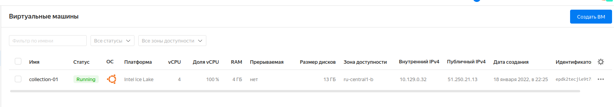
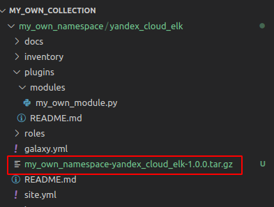
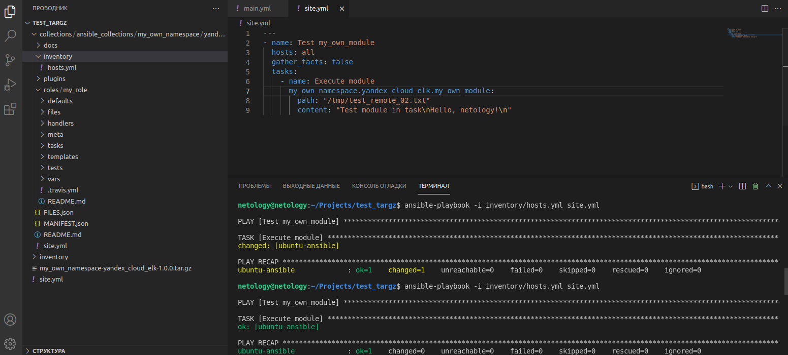

# Домашнее задание к занятию "08.04 Создание собственных modules"

--------------------------------------------------------------
## Подготовка к выполнению

```shell
$ . venv/bin/activate
(venv) netology@netology:~/Projects/my_own_collection/ansible$ pip install -r requirements.txt
Collecting jinja2>=3.0.0
  Using cached Jinja2-3.0.3-py3-none-any.whl (133 kB)
Collecting PyYAML
  Downloading PyYAML-6.0-cp38-cp38-manylinux_2_5_x86_64.manylinux1_x86_64.manylinux_2_12_x86_64.manylinux2010_x86_64.whl (701 kB)
     |████████████████████████████████| 701 kB 499 kB/s 
Collecting cryptography
  Downloading cryptography-36.0.1-cp36-abi3-manylinux_2_17_x86_64.manylinux2014_x86_64.whl (3.8 MB)
     |████████████████████████████████| 3.8 MB 3.1 MB/s 
Collecting packaging
  Using cached packaging-21.3-py3-none-any.whl (40 kB)
Collecting resolvelib<0.6.0,>=0.5.3
  Using cached resolvelib-0.5.4-py2.py3-none-any.whl (12 kB)
Collecting MarkupSafe>=2.0
  Using cached MarkupSafe-2.0.1-cp38-cp38-manylinux2010_x86_64.whl (30 kB)
Collecting cffi>=1.12
  Using cached cffi-1.15.0-cp38-cp38-manylinux_2_12_x86_64.manylinux2010_x86_64.whl (446 kB)
Collecting pyparsing!=3.0.5,>=2.0.2
  Using cached pyparsing-3.0.6-py3-none-any.whl (97 kB)
Collecting pycparser
  Using cached pycparser-2.21-py2.py3-none-any.whl (118 kB)
Installing collected packages: MarkupSafe, jinja2, PyYAML, pycparser, cffi, cryptography, pyparsing, packaging, resolvelib
Successfully installed MarkupSafe-2.0.1 PyYAML-6.0 cffi-1.15.0 cryptography-36.0.1 jinja2-3.0.3 packaging-21.3 pycparser-2.21 pyparsing-3.0.6 resolvelib-0.5.4
(venv) netology@netology:~/Projects/my_own_collection/ansible$ . hacking/env-setup
running egg_info
creating lib/ansible_core.egg-info
writing lib/ansible_core.egg-info/PKG-INFO
writing dependency_links to lib/ansible_core.egg-info/dependency_links.txt
writing entry points to lib/ansible_core.egg-info/entry_points.txt
writing requirements to lib/ansible_core.egg-info/requires.txt
writing top-level names to lib/ansible_core.egg-info/top_level.txt
writing manifest file 'lib/ansible_core.egg-info/SOURCES.txt'
reading manifest file 'lib/ansible_core.egg-info/SOURCES.txt'
reading manifest template 'MANIFEST.in'
warning: no files found matching 'SYMLINK_CACHE.json'
warning: no previously-included files found matching 'docs/docsite/rst_warnings'
warning: no previously-included files found matching 'docs/docsite/rst/conf.py'
warning: no previously-included files found matching 'docs/docsite/rst/index.rst'
warning: no previously-included files matching '*' found under directory 'docs/docsite/_build'
warning: no previously-included files matching '*.pyc' found under directory 'docs/docsite/_extensions'
warning: no previously-included files matching '*.pyo' found under directory 'docs/docsite/_extensions'
warning: no files found matching '*.ps1' under directory 'lib/ansible/modules/windows'
writing manifest file 'lib/ansible_core.egg-info/SOURCES.txt'

Setting up Ansible to run out of checkout...

PATH=/home/netology/Projects/my_own_collection/ansible/bin:/home/netology/Projects/my_own_collection/ansible/venv/bin:/home/netology/.local/bin:/home/netology/.local/bin:/usr/local/sbin:/usr/local/bin:/usr/sbin:/usr/bin:/sbin:/bin:/usr/games:/usr/local/games:/snap/bin:/home/netology/.local/bin
PYTHONPATH=/home/netology/Projects/my_own_collection/ansible/test/lib:/home/netology/Projects/my_own_collection/ansible/lib
MANPATH=/home/netology/Projects/my_own_collection/ansible/docs/man:/usr/local/man:/usr/local/share/man:/usr/share/man

Remember, you may wish to specify your host file with -i

Done!

(venv) netology@netology:~/Projects/my_own_collection/ansible$ ansible --version
[WARNING]: You are running the development version of Ansible. You should only run Ansible from "devel" if you are modifying the Ansible engine, or trying out features under development. This
is a rapidly changing source of code and can become unstable at any point.
ansible [core 2.13.0.dev0] (devel 0ff80a15ba) last updated 2022/01/14 12:10:28 (GMT +300)
  config file = /etc/ansible/ansible.cfg
  configured module search path = ['/home/netology/.ansible/plugins/modules', '/usr/share/ansible/plugins/modules']
  ansible python module location = /home/netology/Projects/my_own_collection/ansible/lib/ansible
  ansible collection location = /home/netology/.ansible/collections:/usr/share/ansible/collections
  executable location = /home/netology/Projects/my_own_collection/ansible/bin/ansible
  python version = 3.8.10 (default, Nov 26 2021, 20:14:08) [GCC 9.3.0]
  jinja version = 3.0.3
  libyaml = True


$ deactivate
netology@netology:~/Projects/my_own_collection/ansible$ . venv/bin/activate && . hacking/env-setup
running egg_info
creating lib/ansible_core.egg-info
writing lib/ansible_core.egg-info/PKG-INFO
writing dependency_links to lib/ansible_core.egg-info/dependency_links.txt
writing entry points to lib/ansible_core.egg-info/entry_points.txt
writing requirements to lib/ansible_core.egg-info/requires.txt
writing top-level names to lib/ansible_core.egg-info/top_level.txt
writing manifest file 'lib/ansible_core.egg-info/SOURCES.txt'
reading manifest file 'lib/ansible_core.egg-info/SOURCES.txt'
reading manifest template 'MANIFEST.in'
warning: no files found matching 'SYMLINK_CACHE.json'
warning: no previously-included files found matching 'docs/docsite/rst_warnings'
warning: no previously-included files found matching 'docs/docsite/rst/conf.py'
warning: no previously-included files found matching 'docs/docsite/rst/index.rst'
warning: no previously-included files matching '*' found under directory 'docs/docsite/_build'
warning: no previously-included files matching '*.pyc' found under directory 'docs/docsite/_extensions'
warning: no previously-included files matching '*.pyo' found under directory 'docs/docsite/_extensions'
warning: no files found matching '*.ps1' under directory 'lib/ansible/modules/windows'
writing manifest file 'lib/ansible_core.egg-info/SOURCES.txt'

Setting up Ansible to run out of checkout...

PATH=/home/netology/Projects/my_own_collection/ansible/bin:/home/netology/Projects/my_own_collection/ansible/venv/bin:/home/netology/.local/bin:/home/netology/.local/bin:/usr/local/sbin:/usr/local/bin:/usr/sbin:/usr/bin:/sbin:/bin:/usr/games:/usr/local/games:/snap/bin:/home/netology/.local/bin
PYTHONPATH=/home/netology/Projects/my_own_collection/ansible/test/lib:/home/netology/Projects/my_own_collection/ansible/lib:/home/netology/Projects/my_own_collection/ansible/test/lib:/home/netology/Projects/my_own_collection/ansible/lib
MANPATH=/home/netology/Projects/my_own_collection/ansible/docs/man:/usr/local/man:/usr/local/share/man:/usr/share/man

Remember, you may wish to specify your host file with -i

Done!

(venv) netology@netology:~/Projects/my_own_collection/ansible$ 
  ```

--------------------------------------------------------------
## Основная часть

#### 1-2 В виртуальном окружении создать новый `my_own_module.py` файл, наполните его содержимым

```shell
$ cd lib/ansible/modules/
(venv) netology@netology:~/Projects/my_own_collection/ansible/lib/ansible/modules$ touch my_own_module.py
(venv) netology@netology:~/Projects/my_own_collection/ansible/lib/ansible/modules$ vim my_own_module.py 
```
* Файл: [my_own_module.py](my_own_namespace/yandex_cloud_elk/plugins/modules/my_own_module.py)

#### 3. Заполните файл в соответствии с требованиями ansible так, чтобы он выполнял основную задачу: module должен создавать текстовый файл на удалённом хосте по пути, определённом в параметре path, с содержимым, определённым в параметре content.

* Обновленный файл:
```python
#!/usr/bin/python

# Copyright: (c) 2018, Terry Jones <terry.jones@example.org>
# GNU General Public License v3.0+ (see COPYING or https://www.gnu.org/licenses/gpl-3.0.txt)
from __future__ import (absolute_import, division, print_function)
__metaclass__ = type
import os.path

DOCUMENTATION = r'''
---
module: my_test

short_description: This is my test module

# If this is part of a collection, you need to use semantic versioning,
# i.e. the version is of the form "2.5.0" and not "2.4".
version_added: "1.0.0"

description: This is my longer description explaining my test module.

options:
    path:
        description: The path for the location of the file being created.
        required: true
        type: str
    content:
        description: The content that should be written to the file being created.
        required: true
        type: str
# Specify this value according to your collection
# in format of namespace.collection.doc_fragment_name
extends_documentation_fragment:
    - my_namespace.my_collection.my_doc_fragment_name

author:
    - Valeriya Tulyakova (@lereklerik)
'''

EXAMPLES = r'''
# Pass in a message
- name: Creating a file with content
  my_namespace.my_collection.my_test:
    path: '/tmp/file.txt'
    content: 'some content'
'''

RETURN = r'''
# These are examples of possible return values, and in general should use other names for return values.
original_message:
    description: The original Content which was passed in.
    type: str
    returned: always
    sample: 'some content'
message:
    description: The output message that the module generates.
    type: str
    returned: always
    sample: 'file was written'
'''

from ansible.module_utils.basic import AnsibleModule


def run_module():
    # define available arguments/parameters a user can pass to the module
    module_args = dict(
        path=dict(type='str', required=True),
        content=dict(type='str', required=True)
    )

    # seed the result dict in the object
    # we primarily care about changed and state
    # changed is if this module effectively modified the target
    # state will include any data that you want your module to pass back
    # for consumption, for example, in a subsequent task
    result = dict(
        changed=False,
        original_message='',
        message=''
    )

    # the AnsibleModule object will be our abstraction working with Ansible
    # this includes instantiation, a couple of common attr would be the
    # args/params passed to the execution, as well as if the module
    # supports check mode
    module = AnsibleModule(
        argument_spec=module_args,
        supports_check_mode=True
    )

    # if the user is working with this module in only check mode we do not
    # want to make any changes to the environment, just return the current
    # state with no modifications
    if module.check_mode:
        module.exit_json(**result)

    
    if os.path.exists(module.params['path']):
        result['changed'] = False    
        result['message'] = 'File already exist'        
    else:
        target_file = open(module.params['path'],"w")
        target_file.write(module.params['content'])
        target_file.close()
        result['changed'] = True
        result['message'] = 'File was created!'

    # manipulate or modify the state as needed (this is going to be the
    # part where your module will do what it needs to do)
    result['original_message'] = module.params['content']

    # in the event of a successful module execution, you will want to
    # simple AnsibleModule.exit_json(), passing the key/value results
    module.exit_json(**result)


def main():
    run_module()


if __name__ == '__main__':
    main()

```

#### 4. Проверьте module на исполняемость локально.

* Добавила файл `args.json`:

```json
{
    "ANSIBLE_MODULE_ARGS": {
        "path": "/tmp/test_01.txt",
        "content": "Hello, netology!"
    }
}
```
* Проверка исполняемости:

```shell
(venv) netology@netology:~/Projects/my_own_collection/ansible$ python -m ansible.modules.my_own_module args.json 

{"changed": true, "original_message": "Hello, netology!", "message": "File was created!", "invocation": {"module_args": {"path": "/tmp/test_01.txt", "content": "Hello, netology!"}}}
```
* Посмотрим содержимое файла:

```shell
(venv) netology@netology:~/Projects/my_own_collection/ansible$ cat /tmp/test_01.txt 
Hello, netology!
```

* Изменим аргументы и попробуем повторно записать данные в файл:

```json
{
    "ANSIBLE_MODULE_ARGS": {
        "path": "/tmp/test_01.txt",
        "content": "Hello, netology!\nChecking multiline text"
    }
}
```

```shell
(venv) netology@netology:~/Projects/my_own_collection/ansible$ cat /tmp/test_01.txt 
Hello, netology!(venv) netology@netology:~/Projects/my_own_collection/ansible$ python -m ansible.modules.my_own_module args.json 

{"changed": false, "original_message": "Hello, netology!\n Checking multiline text", "message": "File already exist", "invocation": {"module_args": {"path": "/tmp/test_01.txt", "content": "Hello, netology!\n Checking multiline text"}}}
```
* Файл уже создан =) Попробуем создать новый с этим же контентом:

```json
{
    "ANSIBLE_MODULE_ARGS": {
        "path": "/tmp/test_02.txt",
        "content": "Hello, netology!\nChecking multiline text"
    }
}
```

```shell
(venv) netology@netology:~/Projects/my_own_collection/ansible$ python -m ansible.modules.my_own_module args.json 

{"changed": true, "original_message": "Hello, netology!\n Checking multiline text", "message": "File was created!", "invocation": {"module_args": {"path": "/tmp/test_02.txt", "content": "Hello, netology!\n Checking multiline text"}}}
```
* Проверим наличие файла и его содержимое:

```shell
(venv) netology@netology:~/Projects/my_own_collection/ansible$ cat /tmp/test_02.txt 
Hello, netology!
Checking multiline text
```

#### 5. Напишите single task playbook и используйте module в нём.

* site.yml:

```yaml
---
- name: Test my_own_module
  hosts: localhost
  gather_facts: false
  tasks:
    - name: Execute module
      my_own_module:
        path: "/tmp/test_03.txt"
        content: "Test module in task\nHello, netology!\n"
```

```shell
(venv) netology@netology:~/Projects/my_own_collection/ansible$ ansible-playbook site.yml 
[WARNING]: You are running the development version of Ansible. You should only run Ansible from "devel" if you are modifying the Ansible engine, or trying out features under development. This
is a rapidly changing source of code and can become unstable at any point.
[WARNING]: provided hosts list is empty, only localhost is available. Note that the implicit localhost does not match 'all'

PLAY [Test my_own_module] **********************************************************************************************************************************************************************

TASK [Execute module] **************************************************************************************************************************************************************************
changed: [localhost]

PLAY RECAP *************************************************************************************************************************************************************************************
localhost                  : ok=1    changed=1    unreachable=0    failed=0    skipped=0    rescued=0    ignored=0   
```

* Наш файл:

```shell
(venv) netology@netology:~/Projects/my_own_collection/ansible$ cat /tmp/test_03.txt 
Test module in task
Hello, netology!
```


#### 6. Проверьте через playbook на идемпотентность.

* Проверим на идемпотентность:

```shell
(venv) netology@netology:~/Projects/my_own_collection/ansible$ ansible-playbook site.yml 
[WARNING]: You are running the development version of Ansible. You should only run Ansible from "devel" if you are modifying the Ansible engine, or trying out features under development. This
is a rapidly changing source of code and can become unstable at any point.
[WARNING]: provided hosts list is empty, only localhost is available. Note that the implicit localhost does not match 'all'

PLAY [Test my_own_module] **********************************************************************************************************************************************************************

TASK [Execute module] **************************************************************************************************************************************************************************
ok: [localhost]

PLAY RECAP *************************************************************************************************************************************************************************************
localhost                  : ok=1    changed=0    unreachable=0    failed=0    skipped=0    rescued=0    ignored=0   
```

#### 7. Выйдите из виртуального окружения.
#### 8. Инициализируйте новую collection: ansible-galaxy collection init my_own_namespace.yandex_cloud_elk

```shell
(venv) netology@netology:~/Projects/my_own_collection/ansible$ deactivate
netology@netology:~/Projects/my_own_collection/ansible$ cd ..
netology@netology:~/Projects/my_own_collection$ ansible-galaxy collection init my_own_namespace.yandex_cloud_elk
[WARNING]: You are running the development version of Ansible. You should only run Ansible from "devel" if you are modifying the Ansible engine, or trying out features under development. This
is a rapidly changing source of code and can become unstable at any point.
- Collection my_own_namespace.yandex_cloud_elk was created successfully
```
#### 9. В данную collection перенесите свой module в соответствующую директорию.

* Создала ВМ в yandex.cloud

```shell
$ ssh 51.250.21.13
The authenticity of host '51.250.21.13 (51.250.21.13)' can't be established.
ECDSA key fingerprint is SHA256:P0gn4Yu4hieXq2GS5mX8hEQ9MhAYAjcz5epK+kMzmA8.
Are you sure you want to continue connecting (yes/no/[fingerprint])? yes
Warning: Permanently added '51.250.21.13' (ECDSA) to the list of known hosts.
Welcome to Ubuntu 20.04.3 LTS (GNU/Linux 5.4.0-42-generic x86_64)

 * Documentation:  https://help.ubuntu.com
 * Management:     https://landscape.canonical.com
 * Support:        https://ubuntu.com/advantage

The programs included with the Ubuntu system are free software;
the exact distribution terms for each program are described in the
individual files in /usr/share/doc/*/copyright.

Ubuntu comes with ABSOLUTELY NO WARRANTY, to the extent permitted by
applicable law.

```
```shell
netology@netology:~/Projects/my_own_collection$ cp ansible/lib/ansible/modules/my_own_module.py my_own_namespace/yandex_cloud_elk/plugins/modules
```

#### 10. Single task playbook преобразуйте в single task role и перенесите в collection. У role должны быть default всех параметров module
#### 11. Создайте playbook для использования этой role.

```shell
netology@netology:~/Projects/my_own_collection/my_own_namespace/yandex_cloud_elk/roles$ ansible-galaxy role init my_role
[WARNING]: You are running the development version of Ansible. You should only run Ansible from "devel" if you are modifying the Ansible engine, or trying out features under development. This
is a rapidly changing source of code and can become unstable at any point.
- Role my_role was created successfully
```

* [defaults/main.yml](my_own_namespace/yandex_cloud_elk/roles/my_role/defaults/main.yml):

```yaml
---
test_path: "/tmp/test_remote_01.txt"
test_content: "Test module in task\nHello, netology!\n"
```
* [tasks/main.yml](my_own_namespace/yandex_cloud_elk/roles/my_role/tasks/main.yml):

```yaml
---
- name: Execute module
  my_own_module:
    path: "{{ test_path }}"
    content: "{{ test_content }}"
```

* [inventory/hosts.yml](my_own_namespace/yandex_cloud_elk/inventory/hosts.yml):

```yaml
---
my_test:
  hosts:
    ubuntu-ansible:
      ansible_host: 51.250.21.13
      ansible_connection: ssh
```

* [site.yml](my_own_namespace/yandex_cloud_elk/site.yml):
```yaml
---
- name: Test my_own_module in yandex.cloud
  hosts:
    - ubuntu-ansible
  roles:
    - my_role
```

* Хост в `yandex.cloud`:



* Запуск playbook:

```shell
netology@netology:~/Projects/my_own_collection/my_own_namespace/yandex_cloud_elk$ ansible-playbook -i inventory/hosts.yml site.yml 
[WARNING]: You are running the development version of Ansible. You should only run Ansible from "devel" if you are modifying the Ansible engine, or trying out features under development. This
is a rapidly changing source of code and can become unstable at any point.

PLAY [Test my_own_module in yandex.cloud] ******************************************************************************************************************************************************

TASK [Gathering Facts] *************************************************************************************************************************************************************************
ok: [ubuntu-ansible]

TASK [my_role : Execute module] ****************************************************************************************************************************************************************
changed: [ubuntu-ansible]

PLAY RECAP *************************************************************************************************************************************************************************************
ubuntu-ansible             : ok=2    changed=1    unreachable=0    failed=0    skipped=0    rescued=0    ignored=0   
```

* Проверка файла на удаленном хосте:

```shell
netology@collection-01:~$ cat /tmp/test_remote_01.txt 
Test module in task
Hello, netology!
```

* Проверка на идемпотентность:

```shell
netology@netology:~/Projects/my_own_collection/my_own_namespace/yandex_cloud_elk$ ansible-playbook -i inventory/hosts.yml site.yml 
[WARNING]: You are running the development version of Ansible. You should only run Ansible from "devel" if you are modifying the Ansible engine, or trying out features under development. This
is a rapidly changing source of code and can become unstable at any point.

PLAY [Test my_own_module in yandex.cloud] ******************************************************************************************************************************************************

TASK [Gathering Facts] *************************************************************************************************************************************************************************
ok: [ubuntu-ansible]

TASK [my_role : Execute module] ****************************************************************************************************************************************************************
ok: [ubuntu-ansible]

PLAY RECAP *************************************************************************************************************************************************************************************
ubuntu-ansible             : ok=2    changed=0    unreachable=0    failed=0    skipped=0    rescued=0    ignored=0   

```

#### 12. Заполните всю документацию по collection, выложите в свой репозиторий, поставьте тег 1.0.0 на этот коммит.

* Документация [тут](my_own_namespace/yandex_cloud_elk/README.md)

#### 13. Создайте .tar.gz этой collection: ansible-galaxy collection build в корневой директории collection.

```shell
netology@netology:~/Projects/my_own_collection/my_own_namespace/yandex_cloud_elk$ ansible-galaxy collection build
Created collection for my_own_namespace.yandex_cloud_elk at /home/netology/Projects/my_own_collection/my_own_namespace/yandex_cloud_elk/my_own_namespace-yandex_cloud_elk-1.0.0.tar.gz
```


#### 14. Создайте ещё одну директорию любого наименования, перенесите туда single task playbook и архив c collection.
#### 15. Установите collection из локального архива: ansible-galaxy collection install <archivename>.tar.gz

```shell
netology@netology:~/Projects$ mkdir test_targz
netology@netology:~/Projects$ cd test_targz/
netology@netology:~/Projects/test_targz$ ls
my_own_namespace-yandex_cloud_elk-1.0.0.tar.gz
netology@netology:~/Projects/test_targz$ ansible-galaxy collection install my_own_namespace-yandex_cloud_elk-1.0.0.tar.gz -p collections
Starting galaxy collection install process
[WARNING]: The specified collections path '/home/netology/Projects/test_targz/collections' is not part of the configured Ansible
collections paths '/home/netology/.ansible/collections:/usr/share/ansible/collections'. The installed collection won't be picked up
in an Ansible run.
Process install dependency map
Starting collection install process
Installing 'my_own_namespace.yandex_cloud_elk:1.0.0' to '/home/netology/Projects/test_targz/collections/ansible_collections/my_own_namespace/yandex_cloud_elk'
my_own_namespace.yandex_cloud_elk:1.0.0 was installed successfully
```

```shell
netology@netology:~/Projects/test_targz$ tree
.
├── collections
│   └── ansible_collections
│       └── my_own_namespace
│           └── yandex_cloud_elk
│               ├── docs
│               ├── FILES.json
│               ├── inventory
│               │   └── hosts.yml
│               ├── MANIFEST.json
│               ├── plugins
│               │   ├── modules
│               │   │   └── my_own_module.py
│               │   └── README.md
│               ├── README.md
│               ├── roles
│               │   └── my_role
│               │       ├── defaults
│               │       │   └── main.yml
│               │       ├── files
│               │       ├── handlers
│               │       │   └── main.yml
│               │       ├── meta
│               │       │   └── main.yml
│               │       ├── README.md
│               │       ├── tasks
│               │       │   └── main.yml
│               │       ├── templates
│               │       ├── tests
│               │       │   ├── inventory
│               │       │   └── test.yml
│               │       └── vars
│               │           └── main.yml
│               └── site.yml
├── inventory
│   └── hosts.yml
├── my_own_namespace-yandex_cloud_elk-1.0.0.tar.gz
└── site.yml

19 directories, 18 files
```

#### 16. Запустите playbook, убедитесь, что он работает.



* Проверка наличия файла: 
```shell
netology@collection-01:~$ cat /tmp/test_remote_02.txt 
Test module in task
Hello, netology!

```